<a name="ENCRYPTER-Challenge-Oracle-ONE">
<h1 align="center" style="font-weight: 500;">
    
    ENCRYPTER-Challenge-Oracle-ONE 
    
      
    <a href="https://waamir104.github.io/ENCRYPTER-Challenge-Oracle-ONE/" target="_blank">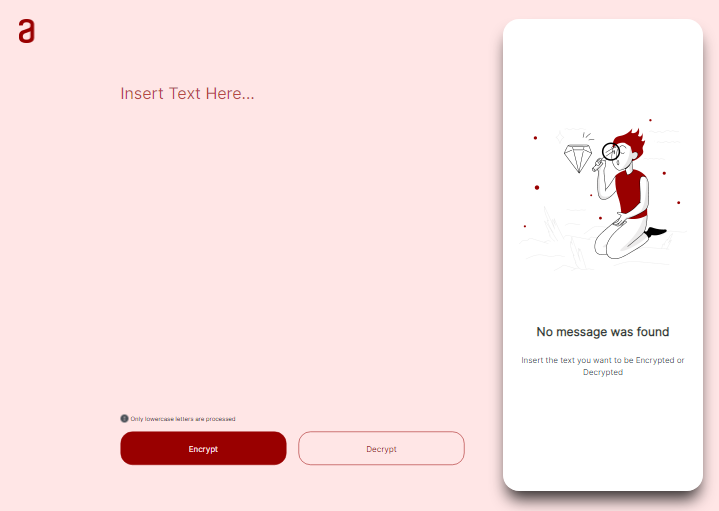</a>
</h1>

    
    
    
    
    
    
    
    
    
    
    
    
    
    
    

 

> **We are working hard on Encrypter v3. If you are new to this Web Aplication, read this document, then try using the [Encrypter v2.2 website](https://waamir104.github.io/ENCRYPTER-Challenge-Oracle-ONE/).**

> Older versions and the code are available at [Encrypter versions](https://github.com/waamir104/ENCRYPTER-Challenge-Oracle-ONE/tags).

> Mark this repository with a **Star** :star2:
 

# :trophy: Badges

# :pencil: Index

* [ENCRYPTER-Challenge-Oracle-ONE](#ENCRYPTER-Challenge-Oracle-ONE)
* [Badges](#trophy-badges)
* [Introduction](#bulb-introduction)
* [Project Status](#project-status-traffic_light)
* [Usage](#usage)
    * [Encryption](#encryption-lock)
    * [Decryption](#decryption-unlock)
* [Demostration](#mag_right-demostration)
    * [Encryption](#encryption-lock-1)
    * [Decryption](#decryption-unlock-1)
* [Tecnologies](#computer-tecnologies)
    * [For Development](#for-development)
    * [For Versioning](#for-versioning)
* [Design](#art-design)
    * [Figma Design](#figma__Design)
    * [Final Design](#final__Design)
* [Responsive Design](#gem-responsive-design)
* [Download](#download-arrow_double_down)
    * [Fork](#small_orange_diamond-fork)
    * [Download ZIP](#small_orange_diamond-download-zip)
    * [Clone GIT](#small_orange_diamond-clone-git)
* [Secret Message](#secret-message-exclamationexclamation)
* [Contact](#e-mail-contact)

# :bulb: Introduction

Project under development as a result of the first Challenge proposed by ONE (Oracle Next Education) and Alura Latam.

The Challenge consists of building a website that allows a user to encrypt and and decrypt the text that the user inserts and to present the result of the action chosen by the user in the corresponding encrypted or decrypted form.

# Project Status :traffic_light:

:construction: *Project under Construction* :construction:
 
 

#  Usage

This Web Aplication is a project for Encrypting messages, so you can exchange secret messages with other people who know the secret of the encryption used. To try the Encrypter Web Aplication last version click [HERE!!](https://waamir104.github.io/ENCRYPTER-Challenge-Oracle-ONE/)

- It must only work with lower case letters.
- Letters with special characters shouldn't be used.
- It must be posible to convert a word to the encrypted version, as well as return an encrypted word to its original version.
- The website must have fields for insertion of the text that will be encrypted or decrypted, and the user must be able to choose between the two options.
- The result of the action chosen by the user should appear on the screen.

Taking into account the freedom that the ONE program gave us to change the visual of the website, a curtain with a Matrix Effect was added to cover the ouput message immediately, giving the user a "sense of security". To see the message (encrypted or decrypted) it is only necessary to hover over the Matrix Curtain and it will gradually fade away.

## Encryption :lock:

By inserting the message in the text field and clicking the **Encrypt** button , the web aplication will go through the text character by character looking to replace the present vowels with the following default codes: 

`The letter "e" becomes "enter"`  
`The letter "i" becomes "imes"`  
`The letter "a" becomes "ai"`  
`The letter "o" becomes "ober"`  
`The letter "u" becomes "ufat"`   

## Decryption :unlock:

In this case, the web aplication will go through the encrypted message looking for the **key words**, verifying that the subsequence characters are the same as the code shown above. If so, the **key words** will be replaced with the respective vowel as is indicated below:

`The letter "enter" becomes "e"`  
`The letter "imes" becomes "i"`  
`The letter "ai" becomes "a"`  
`The letter "ober" becomes "o"`  
`The letter "ufat" becomes "u"`   

# :mag_right: Demostration

 ## Encryption :lock:

| INPUT | OUTPUT |
| ----------- | ----------- |
| `field` | `fimesenterld` |
| `insert the message` | `imesnsenterrt thenter menterssaigenter` |
| `oracle next education` | `oberraiclenter nenterxt enterdufatcaitimesobern` |

 ## Decryption :unlock:

| INPUT | OUTPUT |
| ----------- | ----------- |
| `ailufatrai laitaim` | `alura latam` |
| `probergraimmimesng bentergimesnnenterr` | `programming beginner` |
| `jaivaiscrimespt` | `javascript` |

# :computer: Tecnologies

## For Development

- **HTML**: The HyperText Markup Language is the standard markup language for documents designed to be displayed in a web browser.
- **JavaScript**: is a versatile programming language that can be used to develop complex applications. Interpreters for JavaScript are integrated in all modern web browsers, so the language is considerably widespread.
- **CSS**: Cascading Style Sheets is a style sheet language used for describing the presentation of a document written in a markup language such as HTML or XML

## For Versioning

- **GIT**: Git is a free and open source distributed version control system designed to handle everything from small to very large projects with speed and efficiency.
- **GitHub**: GitHub is an Internet hosting service for software development and version control using Git.

# :art: Design

For this challenge, a base model in Figma was provided, leaving it up to the developer to decide whether or not to implement it. Allowing the developer to explore their creativity by choosing not to use the base model.

I decided to go for the base model provided, with only some changes like:

- The template main color
- Adding a Matrix Effect

<a name="figma__Design">
<h2 align="center">
     
    Figma Design 
    
</h2>

<h2 align="center">
    
</h2>

<a name="final__Design">
<h2 align="center">
    
    Final Design
    
</h2>

<h2 align="center">
    
    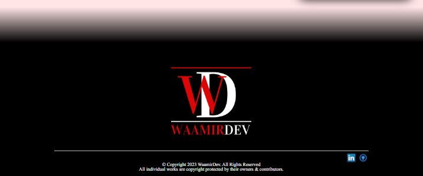
</h2>

<a name="final__Design__Matrix">
<h2 align="center">
    
    Final Design Matrix
    
</h2>

<h2 align="center">
    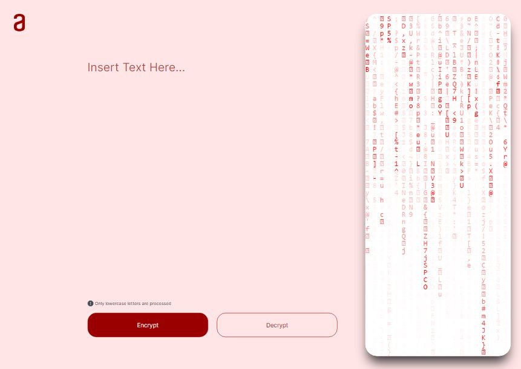
</h2>

# :gem: Responsive Design

Taking into account the Figma base model of the website provided by ONE (Oracle Next Education) and Alura Latam, in which you could see the different sizes that the program was require to adapt, it was necessary to add some @media queries.

After the process of successfully creating the responsive design, we were left with an almost fully responsive website, the results of this process are shown below:

* **Screen Width Below 1040px**

<h2 align="center">
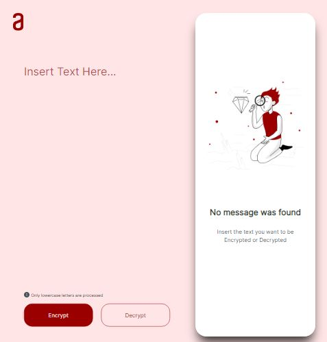
</h2>

* **Screen Width Below 900px**

<h2 align="center">
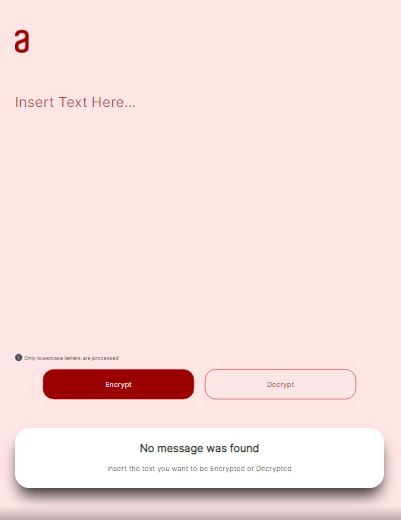
</h2>

* **Screen Width Below 450px**

<h2 align="center">
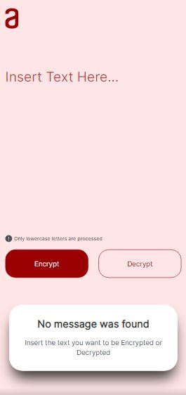
</h2>

* **Screen Width Below 379px**

<h2 align="center">
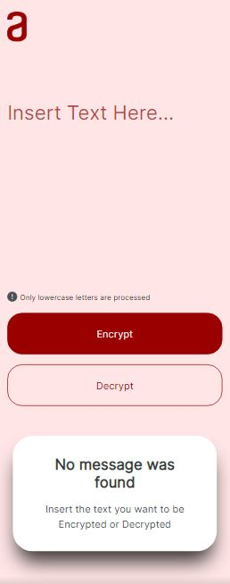
</h2>

# Download :arrow_double_down:

### :small_orange_diamond: Fork

1- Fork the project. In the upper right, click the icon and the option Create a New Fork.

<h2 align="center">
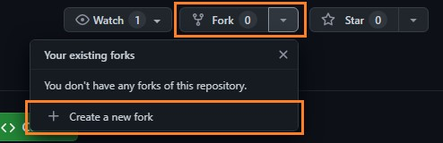
</h2>

2- Once you have the repository forked in your account, check if the URL matches the repository name in your account.

<h2 align="center">
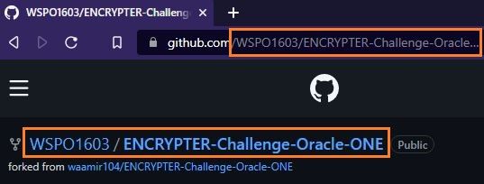
</h2>

### :small_orange_diamond: Download ZIP

To download the .zip file click the **code** button then the download ZIP, when you already have the file you can extract the files.

<h2 align="center">
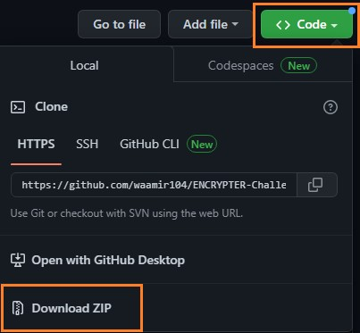
</h2>

### :small_orange_diamond: Clone GIT

1- To Clone the repository, copy the highlighted URL on the image. 
`https://github.com/waamir104/ENCRYPTER-Challenge-Oracle-ONE.git`

<h2 align="center">
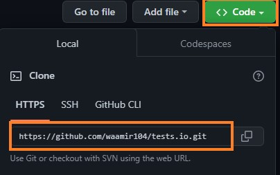
</h2>

2- Create a folder in your computer, open *git bash* and get in the folder, then insert the command line **git clone** and with the right button of the mouse in the terminal click the **Paste** button to paste the url then press the *Enter* key.

<h2 align="center">
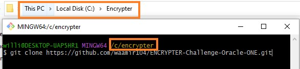
</h2>

#  Secret Message :exclamation::exclamation:

**Decrypt our secret message!**   
`thaink yoberufat venterry mufatch foberr renteraidimesng thenter dobercufatmenterntaitimesobern oberf thimess proberjenterct. imes hoberpenter yoberufat limeskenterd imest, ainy coberncenterrns coberntaict menter.`

`aind plenteraisenter rentermentermbenterr tober mairk thimessrenterpobersimestoberry wimesth ai stair.` :star:

# :e-mail: Contact

We have a few chanels for contact:

* [LinkedIn](https://www.linkedin.com/in/waamirdev-william-pe%C3%B1a/)
* [GitHub Issues](https://github.com/waamir104/ENCRYPTER-Challenge-Oracle-ONE/issues)
* **Email** waamirdev@gmail.com

